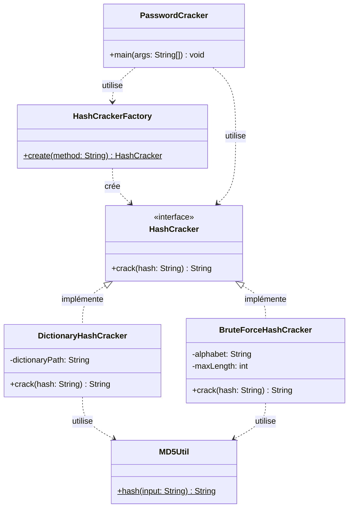

# PasswordCracker — Rapport technique 

## 1. Introduction

Le stockage sécurisé des mots de passe est un enjeu central de la cybersécurité. Plutôt que de conserver les mots de passe en clair, les systèmes modernes les transforment à l'aide de fonctions de hachage cryptographiques comme MD5, ce qui rend leur lecture directe impossible en cas de fuite de données.

Cependant, la robustesse d'un mot de passe ne se mesure pas uniquement à la présence d'un hachage : un mot de passe faible reste vulnérable même haché, car il peut être retrouvé par des techniques comme l'attaque par dictionnaire ou l'attaque par force brute.

Ce mini-projet a pour objectif de développer PasswordCracker, un outil en ligne de commande permettant de retrouver un mot de passe à partir de son empreinte MD5, en implémentant deux stratégies de cassage. L'accent est mis sur la conception orientée objet, et plus particulièrement sur la mise en œuvre du patron de création **Simple Factory**, qui centralise l'instanciation des stratégies de cassage.

## 2. Présentation du problème

Lors d'un audit de sécurité, il est courant de devoir évaluer la robustesse des mots de passe utilisés dans un système. Une méthode consiste à tenter de « casser » le hash d'un mot de passe, c'est-à-dire à retrouver la chaîne de caractères d'origine qui, une fois hachée, produit ce hash.

Deux approches classiques permettent cela :

- L'attaque par dictionnaire : elle consiste à tester une liste de mots courants (issus d'un fichier dictionnaire) en calculant le hash MD5 de chacun et en le comparant au hash recherché. Cette méthode est rapide mais limitée aux mots présents dans le dictionnaire.
- L'attaque par force brute : elle consiste à générer systématiquement toutes les combinaisons possibles de caractères (ici, les lettres minuscules `a-z`, jusqu'à 4 caractères) et à tester chacune d'elles. Cette méthode est exhaustive mais coûteuse en temps, le nombre de combinaisons croissant exponentiellement avec la longueur.

L'outil `passwordCracker` doit permettre de choisir la méthode via un paramètre (`-m BRUTE` ou `-m DICO`) et de fournir le hash à casser (`-h <hash>`), puis d'afficher le mot de passe trouvé ou un message d'échec.

Le défi de conception posé par cet énoncé est le suivant : comment permettre au programme principal de choisir dynamiquement entre plusieurs stratégies de cassage, sans jamais instancier directement les classes concrètes ? C'est précisément le rôle du patron **Simple Factory**.

## 3. Architecture

L'architecture repose sur trois grands principes :

1. Une interface commune (`HashCracker`)** qui définit le contrat que doit respecter toute stratégie de cassage : une méthode `crack(String hash)` qui retourne le mot de passe trouvé, ou `null` si aucun résultat n'est obtenu.
2. Des implémentations concrètes de cette interface, chacune encapsulant une stratégie de cassage indépendante :
   - `DictionaryHashCracker` : parcourt un fichier dictionnaire, calcule le hash MD5 de chaque mot et le compare au hash cible.
   - `BruteForceHashCracker` : génère toutes les combinaisons possibles de caractères (`a` à `z`, longueur 1 à 4) et teste chacune d'elles.
3. Une fabrique centralisée (`HashCrackerFactory`) qui, à partir d'une chaîne de caractères (`"DICO"` ou `"BRUTE"`), instancie et retourne l'implémentation appropriée de `HashCracker`. Le programme principal ne connaît jamais directement les classes concrètes : il ne dépend que de l'interface `HashCracker` et de la fabrique.

Cette architecture repose sur le principe de **polymorphisme** : le code appelant (`PasswordCracker`, la classe `main`) manipule un objet de type `HashCracker` sans savoir s'il s'agit d'une instance de `DictionaryHashCracker` ou de `BruteForceHashCracker`. Cela découple le choix de la stratégie (fait dynamiquement, à l'exécution, selon l'argument `-m`) de son utilisation.

### Responsabilités des classes

| Classe | Rôle | Responsabilités |
|---|---|---|
| `HashCracker` (interface) | Contrat commun | Définit la méthode `crack(String hash): String` que toute stratégie de cassage doit implémenter. Garantit l'interchangeabilité des stratégies (polymorphisme). |
| `DictionaryHashCracker` | Stratégie concrète | Charge une liste de mots depuis un dictionnaire ; calcule le hash MD5 de chaque mot ; compare au hash recherché ; retourne le mot correspondant ou `null`. |
| `BruteForceHashCracker` | Stratégie concrète | Génère toutes les combinaisons de lettres minuscules de longueur 1 à 4 ; calcule le hash MD5 de chaque combinaison ; compare au hash recherché ; retourne la combinaison trouvée ou `null`. |
| `HashCrackerFactory` | Fabrique (Simple Factory) | Centralise la création des objets `HashCracker`. Reçoit une chaîne (`"DICO"` ou `"BRUTE"`) et retourne l'instance concrète correspondante. Isole le `main` de la connaissance des classes concrètes. |
| `PasswordCracker` (main) | Point d'entrée / CLI | Parse les arguments (`-m`, `-h`) ; appelle `HashCrackerFactory.create(...)` pour obtenir la stratégie ; invoque `crack(hash)` ; affiche le résultat (`Password found: ...` ou `Password not found`). |
| `MD5Util` *(utilitaire partagé)* | Service technique | Fournit une méthode statique de calcul du hash MD5 d'une chaîne, réutilisée par les deux stratégies pour éviter la duplication de code. |

## 4. Diagramme UML

**Lecture du diagramme :**
- Les flèches en trait plein avec triangle creux (`<|..`) représentent une **relation d'implémentation** : `DictionaryHashCracker` et `BruteForceHashCracker` implémentent l'interface `HashCracker`.
- Les flèches en pointillés (`..>`) représentent une **dépendance d'utilisation** : la fabrique crée des objets `HashCracker`, le `main` utilise la fabrique et l'interface, et les deux stratégies utilisent `MD5Util` pour calculer les hachages.
- Aucune flèche ne relie directement `PasswordCracker` aux classes concrètes (`DictionaryHashCracker`, `BruteForceHashCracker`) : c'est le principe même du patron Simple Factory, qui centralise et isole l'instanciation.

