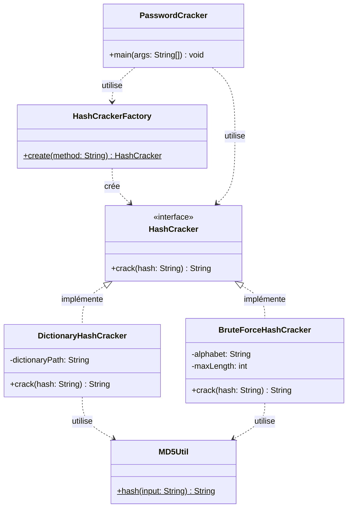
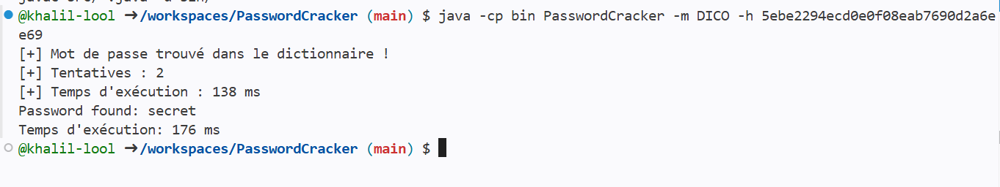
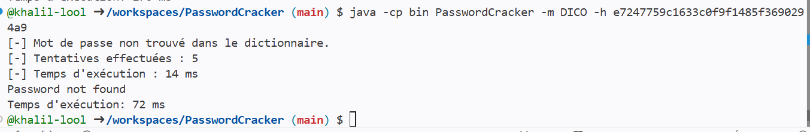
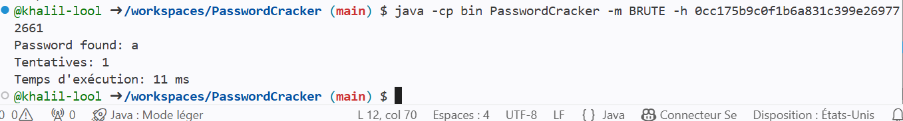
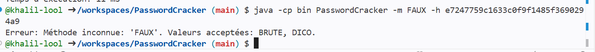

# PasswordCracker — Rapport technique 

## 1. Introduction

Le stockage sécurisé des mots de passe est un enjeu central de la cybersécurité. Plutôt que de conserver les mots de passe en clair, les systèmes modernes les transforment à l'aide de fonctions de hachage cryptographiques comme MD5, ce qui rend leur lecture directe impossible en cas de fuite de données.

Cependant, la robustesse d'un mot de passe ne se mesure pas uniquement à la présence d'un hachage : un mot de passe faible reste vulnérable même haché, car il peut être retrouvé par des techniques comme l'attaque par dictionnaire ou l'attaque par force brute.

Ce mini-projet a pour objectif de développer PasswordCracker, un outil en ligne de commande permettant de retrouver un mot de passe à partir de son empreinte MD5, en implémentant deux stratégies de cassage. L'accent est mis sur la conception orientée objet, et plus particulièrement sur la mise en œuvre du patron de création **Simple Factory**, qui centralise l'instanciation des stratégies de cassage.

## 2. Présentation du problème

Lors d'un audit de sécurité, il est courant de devoir évaluer la robustesse des mots de passe utilisés dans un système. Une méthode consiste à tenter de « casser » le hash d'un mot de passe, c'est-à-dire à retrouver la chaîne de caractères d'origine qui, une fois hachée, produit ce hash.

Deux approches classiques permettent cela :

- L'attaque par dictionnaire : elle consiste à tester une liste de mots courants (issus d'un fichier dictionnaire) en calculant le hash MD5 de chacun et en le comparant au hash recherché. Cette méthode est rapide mais limitée aux mots présents dans le dictionnaire.
- L'attaque par force brute : elle consiste à générer systématiquement toutes les combinaisons possibles de caractères (ici, les lettres minuscules `a-z`, jusqu'à 4 caractères) et à tester chacune d'elles. Cette méthode est exhaustive mais coûteuse en temps, le nombre de combinaisons croissant exponentiellement avec la longueur.

L'outil `passwordCracker` doit permettre de choisir la méthode via un paramètre (`-m BRUTE` ou `-m DICO`) et de fournir le hash à casser (`-h <hash>`), puis d'afficher le mot de passe trouvé ou un message d'échec.

Le défi de conception posé par cet énoncé est le suivant : comment permettre au programme principal de choisir dynamiquement entre plusieurs stratégies de cassage, sans jamais instancier directement les classes concrètes ? C'est précisément le rôle du patron **Simple Factory**.

## 3. Architecture

L'architecture repose sur trois grands principes :

1. Une interface commune (`HashCracker`)** qui définit le contrat que doit respecter toute stratégie de cassage : une méthode `crack(String hash)` qui retourne le mot de passe trouvé, ou `null` si aucun résultat n'est obtenu.
2. Des implémentations concrètes de cette interface, chacune encapsulant une stratégie de cassage indépendante :
   - `DictionaryHashCracker` : parcourt un fichier dictionnaire, calcule le hash MD5 de chaque mot et le compare au hash cible.
   - `BruteForceHashCracker` : génère toutes les combinaisons possibles de caractères (`a` à `z`, longueur 1 à 4) et teste chacune d'elles.
3. Une fabrique centralisée (`HashCrackerFactory`) qui, à partir d'une chaîne de caractères (`"DICO"` ou `"BRUTE"`), instancie et retourne l'implémentation appropriée de `HashCracker`. Le programme principal ne connaît jamais directement les classes concrètes : il ne dépend que de l'interface `HashCracker` et de la fabrique.

Cette architecture repose sur le principe de **polymorphisme** : le code appelant (`PasswordCracker`, la classe `main`) manipule un objet de type `HashCracker` sans savoir s'il s'agit d'une instance de `DictionaryHashCracker` ou de `BruteForceHashCracker`. Cela découple le choix de la stratégie (fait dynamiquement, à l'exécution, selon l'argument `-m`) de son utilisation.

### Responsabilités des classes

| Classe | Rôle | Responsabilités |
|---|---|---|
| `HashCracker` (interface) | Contrat commun | Définit la méthode `crack(String hash): String` que toute stratégie de cassage doit implémenter. Garantit l'interchangeabilité des stratégies (polymorphisme). |
| `DictionaryHashCracker` | Stratégie concrète | Charge une liste de mots depuis un dictionnaire ; calcule le hash MD5 de chaque mot ; compare au hash recherché ; retourne le mot correspondant ou `null`. |
| `BruteForceHashCracker` | Stratégie concrète | Génère toutes les combinaisons de lettres minuscules de longueur 1 à 4 ; calcule le hash MD5 de chaque combinaison ; compare au hash recherché ; retourne la combinaison trouvée ou `null`. |
| `HashCrackerFactory` | Fabrique (Simple Factory) | Centralise la création des objets `HashCracker`. Reçoit une chaîne (`"DICO"` ou `"BRUTE"`) et retourne l'instance concrète correspondante. Isole le `main` de la connaissance des classes concrètes. |
| `PasswordCracker` (main) | Point d'entrée / CLI | Parse les arguments (`-m`, `-h`) ; appelle `HashCrackerFactory.create(...)` pour obtenir la stratégie ; invoque `crack(hash)` ; affiche le résultat (`Password found: ...` ou `Password not found`). |
| `MD5Util` *(utilitaire partagé)* | Service technique | Fournit une méthode statique de calcul du hash MD5 d'une chaîne, réutilisée par les deux stratégies pour éviter la duplication de code. |

## 4. Diagramme UML

**Lecture du diagramme :**
- Les flèches en trait plein avec triangle creux (`<|..`) représentent une **relation d'implémentation** : `DictionaryHashCracker` et `BruteForceHashCracker` implémentent l'interface `HashCracker`.
- Les flèches en pointillés (`..>`) représentent une **dépendance d'utilisation** : la fabrique crée des objets `HashCracker`, le `main` utilise la fabrique et l'interface, et les deux stratégies utilisent `MD5Util` pour calculer les hachages.
- Aucune flèche ne relie directement `PasswordCracker` aux classes concrètes (`DictionaryHashCracker`, `BruteForceHashCracker`) : c'est le principe même du patron Simple Factory, qui centralise et isole l'instanciation.

5. Usage du patron Simple Factory

Le patron Simple Factory est implémenté dans la classe HashCrackerFactory. Son rôle est de centraliser la logique de création des objets HashCracker, afin que le reste du programme n'ait jamais besoin d'instancier directement DictionaryHashCracker ou BruteForceHashCracker.

java
HashCracker cracker = HashCrackerFactory.create("DICO");

Concrètement, la fabrique reçoit une chaîne de caractères représentant la méthode choisie ("BRUTE" ou "DICO"), et retourne l'instance concrète correspondante via un switch :

Si la méthode est "DICO", elle retourne une instance de DictionaryHashCracker.
Si la méthode est "BRUTE", elle retourne une instance de BruteForceHashCracker.
Si la méthode est invalide ou vide, elle lève une IllegalArgumentException avec un message explicite, plutôt que de laisser le programme planter silencieusement.

Avantages apportés par la fabrique simple :

Elle découple le code appelant (PasswordCracker) des classes concrètes : le main ne dépend que de l'interface HashCracker et de la fabrique.
Elle centralise la logique de création à un seul endroit, ce qui facilite la maintenance.
Elle simplifie l'ajout de nouvelles méthodes de cassage du point de vue de l'appelant, qui n'a jamais à changer sa façon d'obtenir une instance.

Inconvénients de la fabrique simple :

Elle ne respecte pas totalement le principe Open/Closed : chaque fois qu'une nouvelle stratégie est ajoutée (par exemple une attaque par table arc-en-ciel), il faut modifier directement le code de HashCrackerFactory (ajouter un nouveau case dans le switch), ce qui viole le principe selon lequel une classe devrait être fermée à la modification.
Elle repose sur une chaîne de caractères ("DICO", "BRUTE") comme identifiant de stratégie, ce qui est fragile : une faute de frappe n'est détectée qu'à l'exécution, pas à la compilation.

Ces limites seront corrigées dans le mini-projet suivant, avec un patron de création plus flexible (par exemple Factory Method ou une fabrique paramétrée par réflexion), qui permettra d'ajouter une stratégie sans modifier la fabrique elle-même.

6. Résultats obtenus

L'outil a été testé avec succès sur les deux méthodes de cassage :

Mode dictionnaire — mot trouvé

Mode dictionnaire — mot non trouvé

Mode force brute — mot trouvé

$ java -cp bin PasswordCracker -m BRUTE -h 0cc175b9c0f1b6a831c399e269772661
Password found: a

Gestion d'erreur — méthode invalide

Ces résultats confirment que :

Les deux stratégies fonctionnent correctement et retournent les résultats attendus.
Le programme affiche des statistiques utiles (nombre de tentatives, temps d'exécution).
Les erreurs de saisie sont gérées proprement, sans plantage du programme.

🎥 Vidéo de démonstration (durée : 4 min 41 s) : https://youtu.be/H8J-hPRIjiI

7. Difficultés rencontrées

Le développement en groupe, avec plusieurs membres codant en parallèle sur des branches séparées, a fait apparaître quelques difficultés typiques d'un travail collaboratif :

Incohérence de nommage entre modules développés séparément : la classe utilitaire MD5Util exposait une méthode nommée hashMD5(String), alors que la stratégie BruteForceHashCracker, développée par un autre membre, appelait MD5Util.hash(String). Cette divergence, invisible tant que les deux fichiers n'étaient pas compilés ensemble, a provoqué une erreur de compilation (cannot find symbol) au moment de l'intégration. Cela a mis en évidence l'importance de figer les signatures des méthodes partagées dès le début du projet, avant que chacun ne code en parallèle sur sa branche.
Fichier manquant lors de l'intégration : le fichier PasswordCracker.java (point d'entrée du programme) n'avait pas été poussé sur le dépôt malgré un message de commit l'annonçant, ce qui bloquait complètement l'exécution du programme même une fois toutes les stratégies prêtes. Ce problème a été identifié grâce à l'historique Git (git log --all -- "*PasswordCracker.java*"), qui a permis de constater qu'aucun commit ne contenait réellement ce fichier finalisé.
Synchronisation des Pull Requests : certaines branches (notamment celle de la stratégie force brute) sont restées un moment non fusionnées dans main, ce qui a retardé les tests d'intégration bout-en-bout jusqu'à ce que toutes les Pull Requests soient traitées.

Ces difficultés ont été résolues par une relecture attentive de l'historique Git (git log --oneline --graph --all), une vérification systématique du contenu réel des branches avant fusion, et une harmonisation des signatures de méthodes partagées.

8. Conclusion

Ce mini-projet a permis de mettre en pratique le patron de conception Simple Factory dans un contexte concret de cybersécurité, en développant un outil de cassage de mots de passe basé sur deux stratégies interchangeables. L'architecture mise en place respecte les principes de polymorphisme et d'encapsulation demandés, et centralise correctement la création des objets via la fabrique.

Le patron Simple Factory a montré ses avantages en termes de découplage et de simplicité d'utilisation, mais aussi ses limites concernant le respect du principe Open/Closed — des limites qui seront directement adressées dans le mini-projet suivant.

Sur le plan collaboratif, ce projet a aussi été l'occasion de travailler avec un vrai flux Git/GitHub à plusieurs (branches, Pull Requests, résolution de conflits), et de mesurer l'importance de la communication et de la définition d'interfaces communes dès le début d'un projet en équipe.

Questions de réflexion
Quels avantages apporte la fabrique simple ? Elle centralise la création des objets, découple le code appelant des classes concrètes, et facilite la maintenance en regroupant la logique d'instanciation à un seul endroit.
Quels sont ses inconvénients ? Elle viole le principe Open/Closed (il faut modifier la fabrique pour ajouter une stratégie), et repose sur des chaînes de caractères comme identifiants, ce qui est source d'erreurs détectées seulement à l'exécution.
Que faut-il modifier lorsqu'une nouvelle stratégie est ajoutée ? Il faut créer la nouvelle classe concrète implémentant HashCracker, puis modifier directement le switch de HashCrackerFactory pour y ajouter un nouveau cas.
La fabrique respecte-t-elle le principe Open/Closed ? Non. Le principe Open/Closed stipule qu'une classe devrait être ouverte à l'extension mais fermée à la modification. Or, ici, chaque nouvelle stratégie nécessite de modifier le code existant de HashCrackerFactory, ce qui viole ce principe. Ce problème sera corrigé dans le mini-projet suivant.

